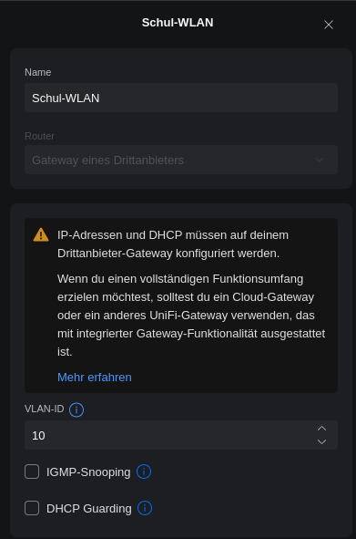
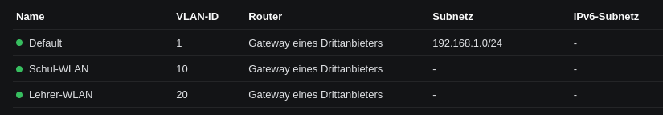
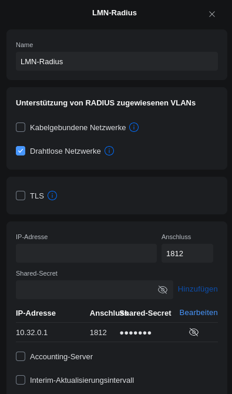

.. include:: /guided-inst.subst
.. _linuxmuster-freeradius-label:

===========================
Netzwerkzugriff über Radius
===========================

.. sectionauthor:: `@cweikl <https://ask.linuxmuster.net/u/cweikl>`_, 
  `@rettich <https://ask.linuxmuster.net/u/rettich>`_

RADIUS (Remote Authentification Dial-In User Service) ist ein Client-Server Protokoll, das zur Authentifizierung, Autorisierung und 
für das Accounting (Triple A - AAA) von Benutzern in einem Netzwerk dient.

Der RADIUS-Server dient als zentraler Authentifizierungsserver, an den sich verschiedene IT-Dienste für die Authentifizierung wenden 
können. RADIUS bietet sich an, um in grossen Netzen sicherzustellen, dass ausschließlich berechtigte Nutzer Zugriff haben. 
Der Zugriff kann zudem auch auf bestimmte Endgeräte beschränkt werden. 
Um die Authentifizierungsdaten zu übertragen, wird oftmals das Protokoll EAP (Extensible Authentification Protocol) genutzt.

Viele Geräte und Anwendungen, wie z.B. Access Points, Captive Portals oder Wireless Controller bieten neben einer einfachen 
Benutzerauthentifizierung auch eine Überprüfung mit Hilfe eines RADIUS-Servers an (WPA-Enterprise, 802.1X). 
Werden die Geräte so konfiguriert, dass diese zur Authentifizierung den RADIUS-Server nutzen, so kann sichergestellt werden, 
dass nur berechtigte Benutzer Zugriff auf z.B. das WLAN haben.

FreeRADIUS: Einsatz in linuxmuster.net
======================================

FreeRadius ist ein Open-Source RADIUS-Server, der in der linuxmuster.net v7 eingesetzt werden kann.

.. hint::

   Es wird grundsätzlich empfohlen, zusätzliche Dienste **nicht** auf dem lmn-Server zu installieren.

Dieser RADIUS-Server kann prinzipiell auf der OPNsense®, dem lmn-Server oder auf einem Docker-Host genutzt werden.

Die Benutzerauthentifizierung erfolgt anhand der Daten im ActiveDirectory (AD) des lmn-Servers, die vom RADIUS-Server via LDAP oder direkt abgefragt werden.

Einsatz auf der OPNsense®
-------------------------

Derzeit unterstützt das OPNsense® - Plugin die ``Radius <-- --> AD`` Kommunikation mithilfe von ``auth_ntlm`` N I C H T.

Eine Dokumentation zur Einrichtung von Freeradius auf der OPNsense® kann daher derzeit nicht erstellt werden.

Einsatz auf dem lmn-Server
--------------------------

Führe nachstehende Schritte durch.

Zugehörigkeit zur Gruppe wifi
^^^^^^^^^^^^^^^^^^^^^^^^^^^^^

Der Zugriff soll über die Schulkonsole gesteuert werden. Dafür werden Benutzer einer speziellen Gruppe wifi hinzugefügt oder daraus entfernt.

.. attention::

    Das Standardverhalten der linuxmuster.net ist, dass ein neu angelegter Benutzer immer in der Gruppe wifi ist, d.h. auch alle Schüler dürfen zunächst in das WLAN, sobald ein WLAN-Zugriff auf Basis dieser Gruppe wifi erstellt wurde.

Zugehörigkeit zur Gruppe wifi einmalig festlegen
^^^^^^^^^^^^^^^^^^^^^^^^^^^^^^^^^^^^^^^^^^^^^^^^

Die Steuerung der Gruppenzugehörigkeit kann auf der Konsole auf dem lmn-Server wie folgt gesetzt werden. 
Wenn Du z.B. nur die Gruppe der Lehrer und der Schüler der Oberstufenklassen „k1“ und „k2“ für den WLAN-Zugang konfigurieren willst, erstellst Du eine Vorlage und setzt die wifi-Gruppe dann wie folgt:

.. code::

   server ~ # cat << EOF > /etc/linuxmuster/sophomorix/default-school/wifi.teachers_and_oberstufe.conf
              MEMBER_ROLE=teacher,globaladministrator
              MEMBER_CLASS=teachers,k1,k2
              EOF

   server ~ # sophomorix-managementgroup --set-wifi teachers_and_oberstufe

Um noch weitere einzelne Schüler hinzuzunehmen oder zu entfernen, nutzt Du danach die Funktion --wifi bzw. --nowifi mit von Komma getrennten Benutzernamen.

.. code::

   server ~ # sophomorix-managementgroup --nowifi lempel,fauli
   server ~ # sophomorix-managementgroup --wifi schlaubi,torti

Freeradius installieren und aktivieren
^^^^^^^^^^^^^^^^^^^^^^^^^^^^^^^^^^^^^^

.. code::

   apt install freeradius
   
.. code::

   systemctl enable freeradius.service

ntlm_auth in samba erlauben
^^^^^^^^^^^^^^^^^^^^^^^^^^^

In der Datei ``/etc/samba/smb.conf`` ist folgende Zeile einzufügen:

.. code::

   [global]
   ...
   ntlm auth = mschapv2-and-ntlmv2-only

Danach muss der samba-ad-dc Dienst neu gestartet werden:

.. code::

   systemctl restart samba-ad-dc.service

Radius konfigurieren
^^^^^^^^^^^^^^^^^^^^

Dem Freeradius-Dient muss Zugriff auf winbind gegeben werden:

.. code::

   usermod -a -G winbindd_priv freerad
   chown root:winbindd_priv /var/lib/samba/winbindd_privileged/

In dem Verzeichnis ``/etc/freeradius/3.0/sites-enabled`` in die Dateien ``default`` und ``inner-tunnel`` ganz am Anfang unter ``authenticate`` ist ``ntlm_auth`` einzufügen.

.. code::

   authenticate {
     ntlm_auth
     # ab hier geht es weiter

In der Datei ``/etc/freeradius/3.0/mods-enabled/mschap`` sind im Abschnitt ``mschap`` zwei Einträge zu ergänzen:

.. code::

   mschap {
          use_mppe = yes
          with_ntdomain_hack = yes
          # hier geht es weiter

Anpassen des Abschnitts ``ntlm_auth`` weiter unten. Zuerst das Kommentarzeichen # entfernen, dann die Zeile folgendermaßen anpassen:

.. code::

   # eine Zeile
   ntlm_auth = "/usr/bin/ntlm_auth --allow-mschapv2 --request-nt-key --domain=DOMÄNE --require-membership-of=DOMÄNE\\wifi --username=%{%{Stripped-User-Name}:-%{%{User-Name}:-None}} --challenge=%{%{mschap:Challenge}:-00} --nt-response=%{%{mschap:NT-Response}:-00}"

Dabei muss DOMÄNE durch den eigenen Domänennamen ersetzt werden. Gebe den Inhalt der Datei ``/etc/hosts`` mit folgendem Befehl aus:

.. code::

   less /etc/hosts

   Ausgabe:

   127.0.0.1 localhost
   10.0.0.1 server.linuxmuster.lan server

Hostname ist im o.g. Beispiel ``server``. Danach folgen Domain und Top-Level-Domain, also: ``.linuxmuster.lan``. DOMÄNE muss in o.g. ntlm_auth in diesem Beispiel durch linuxmuster.lan ersetzt werden.

Die Option ``–require-membership-of=…`` lässt nur Mitglieder der Gruppe wifi zu. So funktioniert die WLAN-Steuerung über die WebUI.

Danach ist die Datei ``/etc/freeradius/3.0/mods-enabled/ntlm_auth`` noch anzupassen. Zuerst ist das Kommentarzeichen # zu entfernen. Danach ist die Zeile wie folgt anzupassen:

.. code::

  exec ntlm_auth {
    wait = yes
       # eine Zeile
       program = "/usr/bin/ntlm_auth --allow-mschapv2 --request-nt-key --domain=DOMÄNE --require-membership-of=DOMÄNE\\wifi --username=%{mschap:User-Name} --password=%{User-Password}"
   }

DOMÄNE ist hierbei wieder wie zuvor zu ersetzen.

In der Datei ``/etc/freeradius/3.0/users`` ist ganz oben nachstehende Zeile einzufügen.

.. code::

   DEFAULT     Auth-Type = ntlm_auth

Nun ist der Freeradius-Dienst neuzustarten:

.. code::
  
   systemctl restart freeradius.service

.. attention::

   Das Defaultverhalten der lmn7 ist, dass ein neu angelegter User immer in der Gruppe wifi ist, d.h. auch alle Schüler dürfen zunächst in das WLAN.

Die Steuerung der Gruppenzugehörigkeit kann auf der Konsole wie folgt gesetzt werden:

.. code::

    sophomorix-managementgroup --nowifi/--wifi user1,user2,...

Um alle Schüler aus der Gruppe wifi zu nehmen, listest Du alle User des Systems auf und schreibst diese in eine Datei. Dies kannst Du wie folgt erledigen:

.. code::

   samba-tool user list > user.txt

Jetzt entferns Du alle User aus der Liste, die immer ins Wlan dürfen sollen. Danach baust Du die Liste zu einer Kommazeile um mit:

.. code::

  less user.txt |  tr '\n' ',' > usermitkomma.txt

Die Datei kann jetzt an den o.g. Sophomorix-Befehl übergeben werden:

.. code::

   sophomorix-managementgroup --nowifi $(less usermitkomma.txt)

WLAN Zertifikate einrichten
^^^^^^^^^^^^^^^^^^^^^^^^^^^

Um allen Clients eine Anmeldung mit Zertifikat zu ermöglichen, ist es notwendig, dass der RADIUS-Server die vollständige Zertifikatskette ausliefert. Zu beachten ist, dass zudem für RADIUS bei
Zertifikaten eine eigene CA hierfür zu nutzen ist. Es gilt das Prinzip des Organisationsvertrauens.

Der Server von linuxmuster.net verfügt bereits über eine eigene CA. Die Zertifikatsdateien finden sich unter ``/etc/linuxmuster/ssl/``.

Mit folgendem Befehl lässt sich der CN des Zertifikats ermitteln:

.. code::

   openssl x509 -in /etc/linuxmuster/ssl/cacert.crt -text -noout |more

In der Ausgabe ist unter ISSUER nach dem Eintrag CN zu suchen. Dieser kann z.B. wie folgt aussehen:

   CN = LINUXMUSTER.LAN

oder 

   CN=GSHOENNINGEN.LINUXMUSTER.LAN

Zunächst ist für RADIUS ein selbst signiertes Zertifikat zu erstellen. Grundlage ist immer ein privater Schlüssel:

.. code::

    cd /etc/linuxmuster/ssl/
    openssl genrsa -out radius-key.pem 4096
    chgrp ssl-cert radius-key.pem

Danach ist ein neues Zertifikat zu beantragen:

.. code::

    openssl req -new -key radius-key.pem -out radius.csr -sha512

Gebe hierbei die gewünschten Informationen an. Bei ``Common Name (e.g. server FQDN or YOUR name) []:`` muss die zuvor ermittelte CN eingetragen werden, die z.B. durch ein vorangestelltes ``radius`` ergänzt wird. Ein korrekter Eintrag wäre z.B.: ``radius.gshoenningen.linuxmuster.lan``

Das Zertifikat ist nun noch auszustellen. Zuvor wird noch das Kennwort für den CA-Key (/etc/linuxmuster/ssl/cakey.pem) benötigt. Das Kennwort findet sich unter ``/etc/linuxmuster/.secret/cakey``.

Zur Ausstellung ist folgender Befehl anzugeben und o.g. Kennwort zum Abschluss anzugeben:

.. code::

   openssl x509 -req -in radius.csr -CA /etc/linuxmuster/ssl/cacert.pem -CAkey /etc/linuxmuster/ssl/cakey.pem -CAcreateserial -out radius.pem -days 365 -sha512

Die erstellten Dateien sowie die cacert-Dateien sind nun in das Freeradius Zertifikats-Verzeichnis zu kopieren sowie Gruppenzugehörigkeiten und Dateiberechtigungen wie folgt anzupassen:

.. code::

    cd /etc/linuxmuster/ssl/
    cp cacert.crt cacert.pem radius.csr radius-key.pem radius.pem /etc/freeradius/3.0/certs/
    cd /etc/freeradius/3.0/certs/
    chgrp freerad cacert.crt cacert.pem radius.csr radius-key.pem radius.pem
    chmod 640 cacert.crt cacert.pem radius.csr radius-key.pem radius.pem

Danach ist ein Zertifikat zu erstellen, das die gesamte Zertifizierungskette enthält:

.. code::

   cd /etc/freeradius/3.0/certs/
   cat radius.pem cacert.pem > fullchain.pem
   chgrp freerad fullchain.pem
   chmod 640 fullchain.pem

Passe nun RADIUS so an, dass das Fullchain-Zertifikat genutzt wird.

.. code::

   nano /etc/freeradius/3.0/mods-enabled/eap

   eap {
        [...]
        tls-config tls-common {
        	    [...]
                private_key_file = /etc/freeradius/3.0/certs/radius-key.pem
                certificate_file = /etc/freeradius/3.0/certs/fullchain.pem
                ca_file = /etc/freeradius/3.0/certs/cacert.pem
               [...]
        }
        [...]
   }

.. hint::

   Je nach Server-Distribution ist ggf. die datei EAP unter /etc/raddb/mods-enabled/eap oder je nach Radius-Version unter /etc/freeradius/3.2/mods-enabled/eap anzupassen.

Danach den Dienst neu starten:

.. code::

   systemctl restart freeradius.service

Melden die Clients sich nun im WLAN an, so liefert der RADIUS die Zertifikatskette aus und bei der ersten Herstellung der Verbindung muss das Zertifikat auf dem Client akzeptiert werden, so dass es dort dann importiert wird.

Auf diese Weise kann WPA-Enterprise auch mit neueren Client-Betriebssystemen genutzt werden.

Firewallregeln anpassen
^^^^^^^^^^^^^^^^^^^^^^^

Auf der Firewall OPNsense® muss je nach eigenen Voraussetzungen dafür gesorgt werden, dass die AP’s aus dem Wlan-Netz den Server auf dem Port 1812 via udp erreichen können. Es ist darauf zu achten, dass die IP des Servers den eigenen Netzvorgaben entspricht (also z.B. 10.0.0.1/16 oder /24 oder 10.16.1.1/16 oder /24)

Die Regel auf der OPNsense® hierzu könnte, wie nachstehend abgebildet, eingetragen werden.

.. figure:: media/lmn7_freeradius_-fw-opnsense-rule-for-radius.png
   :align: center
   :alt: Firewall-Regeln

Jetzt sollte die Authentifizierung per WPA2-Enterprise funktionieren, sofern der Testuser in der Gruppe wifi ist. Ein Zertifikat ist nicht erforderlich.

Sollte das nicht funktionieren, hält man den Freeradius-Dienst an und startet ihn im Debugmodus.

.. code::

   service freeradius stop
   service freeradius debug

Jetzt sieht man alle Vorgänge während man versucht, sich mit einem Device zu verbinden.

APs im Freeradius eintragen
^^^^^^^^^^^^^^^^^^^^^^^^^^^

Die APs müssen im Freeradius noch in der Datei ``/etc/freeradius/3.0/clients.conf`` eingetragen werden. Dies erfolgt wie in nachstehendem Schema dargestellt:

.. code::

   client server {
   ipaddr = 10.0.0.1
   secret = GeHeim
   }

   client opnsense {
   ipaddr = 10.0.0.254
   secret = GeHeim
   }

   client unifi {
   ipaddr = 10.0.0.10
   secret = GeHeim
   }

Um den APs feste IPs zuzuweisen, sollten diese auf dem lmn-Server in der Datei ``/etc/linuxmuster/sophomorix/default-school/devices.csv`` eingetragen sein.

Je nachdem, ob in jedem (Sub)-netz die APs angeschlossen werden, ist die zuvor dargestellte Firewall-Regel anzupassen. Der Radius-Port in der OPNsense® müsste dann z.B. von Subnetz A (blau) zu Subnetz B (grün Servernetz) geöffnet werden, damit alle APs Zugriff auf den Radius-Dienst erhalten.

VLANs mit Freeradius zuweisen
^^^^^^^^^^^^^^^^^^^^^^^^^^^^^

Wenn die Unterscheidung **ist in der Gruppe wifi** oder **ist nicht in der Gruppe wifi** nicht mehr ausreicht, muss der RADIUS-Server via LDAP die Gruppenzugehörigkeit abfragen.

Wenn es beispielsweise ein Schülernetz ohne Druckerzugriff und ein Lehrernetz mit Druckerzugriff gibt, muss der RADIUS den Usern aus der Gruppe teachers das Lehrernetz und den anderen Usern das Schülernetz zuweisen.

Im Folgenden gehen wir davon aus, dass das Schülernetz die VLAN-ID 10 und das Lehrernetz die VLAN-ID 20 hat.

Als erstes muss mit ``apt install freeradius-ldap`` das freeradius-ldap-modul installiert werden.
Wechsle mit ``cd /etc/freeradius/3.0/mods-enabled/`` in das Verzeichnis **/etc/freeradius/3.0/mods-enabled/**.
Dann wird ldap mit ``ln -s ../mods-available/ldap ldap`` aktiviert.
In ``/etc/freeradius/3.0/mods-enabled/ldap`` müssen folgende Eintragungen gemacht/angepasst werden:

.. code::

  ldap {
    server = 'ldaps://server.linuxmuster.lan'
    identity = 'CN=global-binduser,OU=Management,OU=GLOBAL,DC=linuxmuster,DC=lan'
    password = Mk5ZXi1XTt7iRouX
    base_dn = 'OU=default-school,OU=SCHOOLS,DC=linuxmuster,DC=lan'
    ...
  }
  
und 

.. code::

  user {
    base_dn = "OU=default-school,OU=SCHOOLS,DC=linuxmuster,DC=lan"
    filter = "(&(objectClass=person)(sAMAccountName=%{%{Stripped-User-Name}:-%{User-Name}})(memberOf=CN=wifi,OU=Management,OU=*))"
    ...
  }
  
  group {
    base_dn = "OU=default-school,OU=SCHOOLS,DC=linuxmuster,DC=lan"
    filter = '(objectClass=group)'
    name_attribute = cn
    membership_attribute = 'memberOf'
    ...
  }

**identity** und das **password** findet man mit:

.. code::

  root@server:~# cat /etc/linuxmuster/webui/config.yml
  linuxmuster:
    ldap:
      binddn: CN=global-binduser,OU=Management,OU=GLOBAL,DC=linuxmuster,DC=lan
      bindpw: Mk5ZXi1XTt7iRouX
      host: server
      searchdn: DC=linuxmuster,DC=lan

Nachdem der LDAP-Zugriff konfiguriert ist, muss nur noch die gruppenabhängige VLAN-Zuordnung erstellt werden. In **/etc/freeradius/3.0/sites-enabled/inner-tunnel** und **/etc/freeradius/3.0/sites-enabled/default** ist in **post-auth** folgende Eintragung zu machen:

.. code::

  post-auth {
    if (Ldap-Group == "teachers"){
      update reply {
        Tunnel-Type :=VLAN,
        Tunnel-Medium-Type:=6,
        Tunnel-Private-Group-Id := 20,
        Reply-Message := "Wilkommen im Lehrer-WLAN"
        }
      }
    else{
      update reply {
        Tunnel-Type :=VLAN,
        Tunnel-Medium-Type:=6,
        Tunnel-Private-Group-Id := 10,
        Reply-Message := "Wilkommen im Schüler-WLAN"
      }
    }

Jetzt muss nur noch der RADIUS mit ``systemctl start freeradius.service`` gestartet werden.

So wird der RADIUS getestet:
.. code::

  root@server:~# radtest ba Muster! server 10 Muster!
  Sent Access-Request Id 200 from 0.0.0.0:45025 to 10.32.0.1:1812 length 72
	User-Name = "ba"
	User-Password = "Muster!"
	NAS-IP-Address = 10.32.0.1
	NAS-Port = 10
	Message-Authenticator = 0x00
	Cleartext-Password = "Muster!"
  Received Access-Accept Id 200 from 10.32.0.1:1812 to 10.32.0.1:45025 length 80
	Message-Authenticator = 0x1c4bb67e743500e6551c3fa2a2e19228
	Tunnel-Type:0 = VLAN
	Tunnel-Medium-Type:0 = IEEE-802
	Tunnel-Private-Group-Id:0 = "20"
	Reply-Message = "Wilkommen im Lehrer-WLAN"
	
oder mit Schülerzugangsdaten

.. code::

  root@server:~# radtest frayka Muster! server 10 Muster!
  Sent Access-Request Id 222 from 0.0.0.0:36803 to 10.32.0.1:1812 length 76
	User-Name = "frayka"
	User-Password = "Muster!"
	NAS-IP-Address = 10.32.0.1
	NAS-Port = 10
	Message-Authenticator = 0x00
	Cleartext-Password = "Muster!"
  Received Access-Accept Id 222 from 10.32.0.1:1812 to 10.32.0.1:36803 length 82
	Message-Authenticator = 0x4917bfcd76547545613363c2098fafa3
	Tunnel-Type:0 = VLAN
	Tunnel-Medium-Type:0 = IEEE-802
	Tunnel-Private-Group-Id:0 = "10"
	Reply-Message = "Wilkommen im Schüler-WLAN"
	

VLANs im Unifi-Controller nutzen
^^^^^^^^^^^^^^^^^^^^^^^^^^^^^^^^

Die VLAN-Zurodnung lässt sich jetzt sehr einfach im Unifi-Controller nutzen.

Die VLANs müssen natürlich auch als Netzwerk im Unifi-Controller definiert sein. Unter **Einstellungen -> Netzwerke** lassen sich die Netzwerke einfach definieren. 

Es muss lediglich ein Name und die VLAN-ID eingegeben werden. Den Rest macht ja die OpnSense.
Wenn alles geklappt hat, sind die Netzwerke wie folgt aufgeführt.

Jetzt muss dem Unifi-Controller noch mitgeteilt werden, dass der RADIUS die VLAN-IDs fürs WLAN liefert. In **Einstellungen -> Übersicht** ist ganz unten die RADIUS-Einstellung.
Mit einem Klick auf den Radius-Server öffnen sich die Einstellungen. Dort muss ein Haken bei **Unterstützung von RADIUS zugewiesenen VLANs** -> **Drahtlose Netzwerke** gesetzt werden.

Wir sind kurz vor dem Ziel. Im Schul-WLAN muss nur noch, ziemlich weit unten, das **Sicherheitsprotokoll** WPA2/WPA3 Enterprise und unter **Radius-Profil** unser RADIUS-Server gewählt werden.

